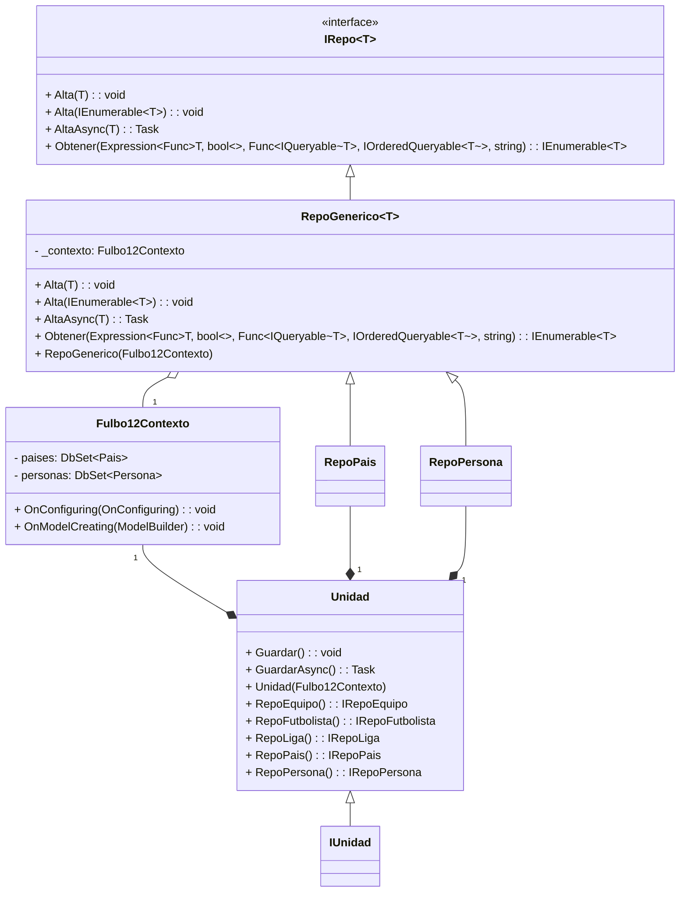

## Código Persistencia.EFC

### Preparando el entorno

Para poder crear la migración, es importante primero haber instalado las herramientas de _Entity Framework Core_ 🦄 con el comando
```shell
dotnet tool install --global dotnet-ef
```

Después en este directorio `src\Fulbo12.Core.Persistencia.EFC` crea tu archivo `appsettings.json` con la siguiente estructura:
```json
{
    "SerVersion": "8.0.29",
    "ConnectionStrings": {
        "dev": "server=localhost;port=3306;user=root;password=root;database=Fulbo12"
    }
}
```
En este ejemplo use la versión de MySQL instalada en la secu junto con su usuario y contraseña de _root_ de las compus de los labos; **si vas a correrlo en tu compu, no te olvides de completar los campos con los de tu SGBD**.

### Manipulando las migraciones

Después de tener configurado tu entorno, corriendo el servicio de `MySQL` 🐬, podes crear la migración posicionandote en el path `src\Fulbo12.Core.Persistencia.EFC` y ejecutar el comando:
```shell
dotnet ef migrations add Migracion
```
Esto va a crear el directorio `src\Fulbo12.Core.Persistencia.EFC\Migrations` con 3 archivos; vas desplegar esta migración en `MySQL` 🐬 con el comando:
```shell
dotnet ef database update
```
Tambien podes ver el script sql que generaría esta migración con el comando 
```shell
dotnet ef dbcontext script
```
Luego deberías ver por consola algo como esto:
```sql
CREATE TABLE `Pais` (
    `idPais` tinyint unsigned NOT NULL AUTO_INCREMENT,
    `pais` varchar(30) CHARACTER SET utf8mb4 NOT NULL,
    CONSTRAINT `PK_Pais` PRIMARY KEY (`idPais`)
) CHARACTER SET=utf8mb4;
```
También podes guardarte el script en el directorio donde estas agregando el parámetro:
```shell
dotnet ef dbcontext script -o nombreArchivo
```
### Configurando nuestras Clases a Tablas

Es importante saber que muchas cosas podriamos configurarlas tipeando encima de nuestras clases de dominio (este sería usar las _[Data Annotation](https://www.entityframeworktutorial.net/efcore/configuration-in-entity-framework-core.aspx)_).

#### Ejemplos de Data Annotation (DA)

```csharp
public abstract class ConNombre
{
    [DatabaseGenerated(DatabaseGeneratedOption.Identity)]
    public byte Id { get; set; }

    [MaxLength(30)]
    [Required]
    public string Nombre { get; set; }
    public ConNombre(string nombre) => Nombre = nombre;
    public ConNombre(string nombre, byte id) : this(nombre)
        => Id = id;
}
```
- Con la DA `[DatabaseGenerated(DatabaseGeneratedOption.Identity)]` estamos indicando que el valor para ese atributo (`Id`) lo va a asignar nuestro SGBD al momento de hacer el `INSERT`.
- `[MaxLength(30)]` solo se usa en cadenas; en este caso estamos indicando que la longitud máxima de la cadena va a ser de 30 caracteres.
- `[Required]` indica que el atributo es `NOT NULL`.

#### Ejemplos con Fluent Api

Otra forma de configurar es mediante Fluent Api (FA); es un poco más tedioso, pero nos permite tener un control mucho mas preciso sobre los mapeos de nuestras Clases a Tablas (incluso hay operaciones que solo se pueden realizar mediante FA).
La forma en la que vamos a trabajar es mediante un archivo de configuración que implemente FA y la interfaz genérica `IEntityTypeConfiguration<T>`. Veamos unos ejemplos dentro de nuestro archivo `MapPais`.
```csharp
public class MapPais : IEntityTypeConfiguration<Pais>
{
    public void Configure(EntityTypeBuilder<Pais> etb)
    {
        etb.ToTable("Pais");

        etb.HasKey(p => p.Id)
            .HasName("PK_Pais");
        etb.Property(p => p.Id)
            .HasColumnName("idPais");

        etb.Property(p => p.Nombre)
            .HasColumnName("pais");
        etb.HasIndex(p => p.Nombre)
            .HasDatabaseName("UQ_Pais_pais")
            .IsUnique();

        etb.HasData(new Pais(IdArgentina, "Argentina"));
    }
}
```
Vemos que por la interfaz tenemos que implementar el método `void Configure(EntityTypeBuilder<T> etb)`. Ya dentro vamos a poder usar el parámetro para configurar nuestro mapeo. Es importante entender que todas las expresiones lambda que vemos, se aplican al tipo que aplicamos para `EntityTypeBuilder<T>` (en nuestro caso van a ser propiedades de `Pais`). Veamos el código en detalle

`etb.ToTable("Pais")` indica el nombre de la tabla.

```csharp
etb.HasKey(p => p.Id)
    .HasName("PK_Pais");
```
Indicamos que el atributo `Id` lo vamos a usar como _PK_ y el nombre de la restricción (_constraint_) va a ser `PK_Pais`.

```csharp
etb.Property(p => p.Id)
    .HasColumnName("idPais");
```
Indicamos que el atributo `Id` va a transformarse a una columna con el nombre `idPais`.

```csharp
etb.HasIndex(p => p.Nombre)
    .HasDatabaseName("UQ_Pais_pais")
    .IsUnique();
```
Indicamos que para el atributo mapeado `Nombre`, vamos a tener una restricción de unicidad (_UNIQUE_) y le asignamos el 
nombre a la constraint de `UQ_Pais_pais`.

Veamos un fragmento del mapeo de nuestra clase `MapPersona`.
```csharp
etb.HasOne(p => p.Pais)
    .WithMany()
    .HasForeignKey("idPais")
    .IsRequired()
    .HasConstraintName("FK_Persona_Pais");
```
Esta es la forma de indicar que tenemos una FK mediante FA. En nuestra clase `Persona` hay una propiedad de navegabilidad llamada `Pais` para indicar el pais de procedencia de nuestra persona y en la clase `Pais` no hay nada que navegue a sus personas.
- `etb.HasOne(p => p.Pais)`: como arrancamos por la clase con dependencia (`Persona` depende de `Pais`) indicamos la cardinalidad de que _"una persona, posee un pais"_.
- `.WithMany()`: ahora definimos la cardinalidad desde el otro lado (`Pais` a `Persona`). Como desde `Pais` no tenemos navegabilidad a `Persona` lo dejamos en blanco (si tuvieras una colección, seria el lugar para declararlo).
- `.HasForeignKey("idPais")`: le indicamos con que nombre va a persistir el SGBD la propiedad (columna) que usamos como FK.
- `.HasConstraintName("FK_Persona_Pais")`: le colocamos nombre a la restricción de clave foránea.

## Diagrama de clases

