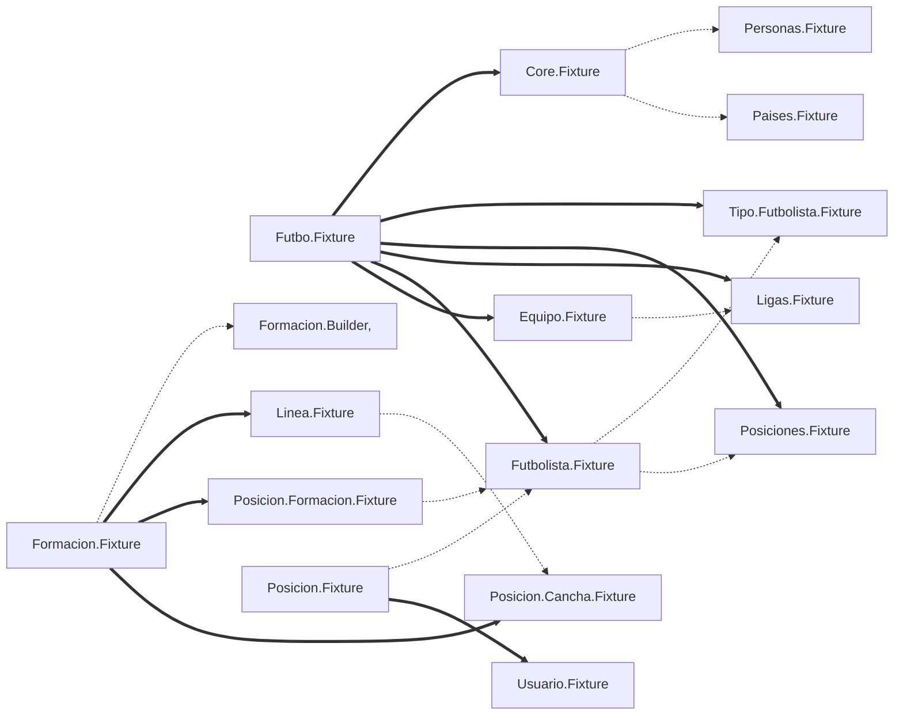

## Dependencia entre Fixtures

```mermaid
flowchart LR

Futbo.Fixture ==> Equipo.Fixture 
Futbo.Fixture ==> Futbolista.Fixture
Futbo.Fixture ==> Ligas.Fixture
Futbo.Fixture ==> Posiciones.Fixture
Futbo.Fixture ==> Tipo.Futbolista.Fixture
Futbo.Fixture ==>  Core.Fixture


Formacion.Fixture==>Posicion.Cancha.Fixture;
Formacion.Fixture==>Posicion.Formacion.Fixture;
Formacion.Fixture==>Linea.Fixture;
Formacion.Fixture-.->Formacion.Builder,

Posicion.Fixture ==>Usuario.Fixture

Core.Fixture-.->Paises.Fixture;
Core.Fixture-.->Personas.Fixture;

Equipo.Fixture-.->Ligas.Fixture;
Posicion.Fixture-.->Futbolista.Fixture;
Posicion.Formacion.Fixture-.->Futbolista.Fixture;
Futbolista.Fixture-.->Posiciones.Fixture;
Futbolista.Fixture-.-> Tipo.Futbolista.Fixture;
Linea.Fixture-.->Posicion.Cancha.Fixture;;

```
