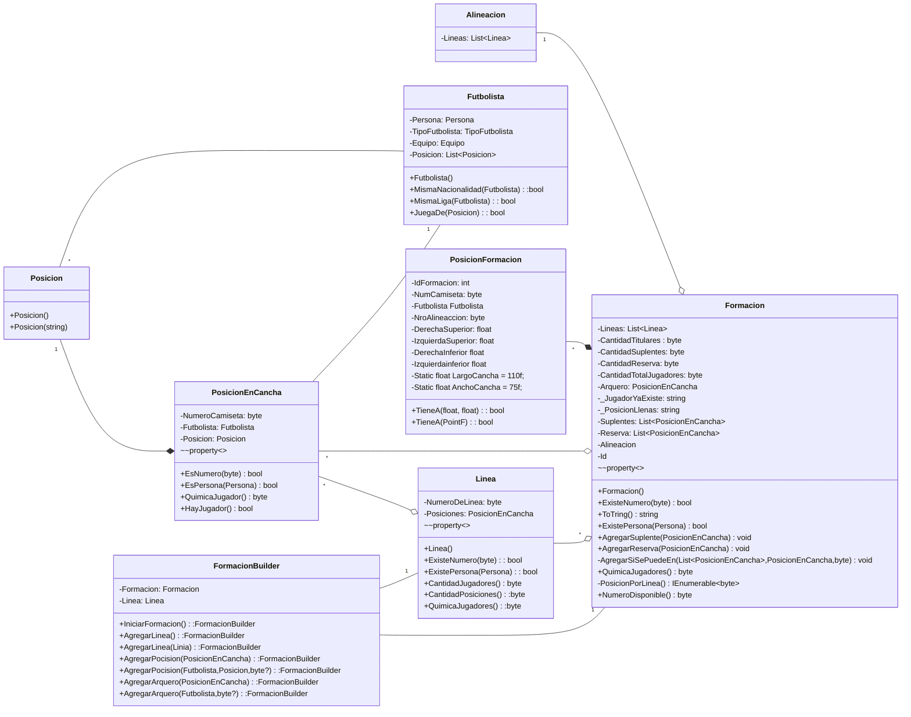

## Diagrama de clases "Formación"




## Código Formación


### Clase PosicionEnCancha

- [x] Propiedad `Jugador` de la posición (puede ser _null_).
- [x] Propiedad `Posicion` que va a cubrir (nunca _null_).
- [x] Propiedad `NumeroCamiseta` (puede ser _null_).
- [x] Propiedad de solo lectura `QuimicaJugador` que devuelva la Química ponderada del jugador (devuelve cero si no hay jugador asignado) con valores entre 1 y 10. Esto vamos a tener que ponernos de acuerdo como ponderar cosas como: `MismoEquipo()`, `JuegaDe()`, `MismoPais()`, etc.
- [x] Método `EsNumero(byte)` que devuelve `true` si la PosicionEnCancha tiene asignada el número recibido por parámetro.
- [x] Propiedad de solo lectura `HayJugador` que devuelve `true` si hay un futbolista asignado (no _null_).
- [x] Método `EsPersona(Persona)` que devuelve `true` si la PosicionEnCancha tiene un futbolista compuesto por esa _Persona_.

### Clase Linea

- [x] Colección de Posiciones.
- [x] Propiedad de solo lectura `QuimicaJugadores` que devuelva la sumatoria de las Químicas de los jugadores que la compongan.
- [x] Propiedad de solo lectura `CantidadJugadores` que devuelva la cantidad de jugadores que componen la linea.
- [x] Propiedad de solo lectura `CantidadPosiciones` que devuelva la cantidad de posiciones que componen la linea (esta propiedad va a ser importante para poder generar la cadena representativa de la formación).
- [x] Definir el método `ExisteNumero(byte)` que reciba como parámetro un numero de camiseta y devuelve `true` si alguna de las posiciones posee tal número.
- [x] Definir el método `ExistePersona(Persona)` que reciba como parámetro una persona y devuelve `true` si alguna de sus posiciones posee tal Futbolista compuesta por esa Persona.

### Clase Formación

- [x] Propiedad de solo lectura `QuimicaJugadores` que devuelva la sumatoria de las Químicas de los jugadores de las Lineas.
- [x] Redefinir el método `ToString()` para que devuelva una cadena representativa de la Formación (ejemplos: _"4 - 4 - 2", "4 - 3 - 1 - 2", "4 - 3 - 3"_). Recordar que no se toma al arquero como parte de la linea. Para redefinir este método podemos usar **[StringBuilder](https://docs.microsoft.com/es-mx/dotnet/api/system.text.stringbuilder?view=net-5.0)** (se sugiere como buena practica, según la documentación oficial es la forma optimizada para crear cadenas).
- [x] Definir el método `ExisteNumero(byte)` que reciba como parámetro un numero de camiseta y devuelve `true` si alguna de las Lineas posee tal número.
- [x] Propiedad de solo lectura `byte NumeroDisponible` que devuelva el primer numero de camiseta (empezando por el 1). La idea va a ser recorrer con un _for_ preguntando si existe el numero en iteración en la Formación (oh, vamos a consumir el método `bool Formacion.ExisteNumero(byte)` ¿quién lo diría :smiley:?).  Hay que tener en cuenta:
1. Hasta donde va a ir el for (fíjense las propiedades estáticas que agregué).
2. En caso de no encontrar un número disponible, devolver una excepción del tipo `InvalidOperationException` con el mensaje _"No hay más dorsales disponibles"_.

### Clase FormacionBuilder

Dado que la formación es un objeto complejo por su composición y correcto orden de creación, es necesario la aplicación de un patrón de creación (el [Builder)](https://sourcemaking.com/design_patterns/builder) para simplificar la instanciación de formaciones. 

Para esta clase vamos a usar el concepto de [Interfaz fluida](https://es.wikipedia.org/wiki/Interfaz_fluida), por lo cual **_ES IMPORTANTE_** que todos los métodos de esta clase, devuelvan una instancia de la misma (es decir, la ultima linea siempre es `return this;`).

- [x] Para facilitar el estado interno de creación, va a ser importante que esta clase tenga instancias privadas de `Formacion` (el _getter_ si puede ser publico) y `Linea`.
- [x] Método `IniciarFormacion()`: instancia la formación interna del builder.
- [x] Método `AgregarLinea()`: instancia la linea interna y la agrega a la formación.
- [x] Método `AgregarPosicion(Futbolista futbolista, Posicion posicion, byte? nro = null)`: instancia una `PosicionEnCancha` (variable interna dentro del método, no hace falta que sea un atributo de la clase) con el futbolista y la posición y la agrega a la linea interna del builder. Con respecto al nro, si tiene un valor se asigna de una, pero si no tiene, la idea es que la formación se lo asigne automáticamente (acá es cuando usamos la propiedad `Formacion.NumeroDisponible` que ya programamos 😎 y ademas quedaría cheto si usamos el operador [??](https://docs.microsoft.com/es-mx/dotnet/csharp/language-reference/operators/null-coalescing-operator#examples)).
- [x] Método `AgregarPosicion(PosicionEnCancha posicionEnCancha)`: para aprovechar las posiciones que ya tenemos instanciadas, vamos a sobrecargar el anterior método recibiendo `PosicionEnCancha`. En caso de que la posición recibida por parámetro no tenga asignado un numero de camiseta, se lo tenemos que asignar de forma análoga al punto anterior. **_ESTARÍA BUENO_** reutilizar código para las 2 versiones de `NuevaPosicion` (en la cual una invoque a la otra), pensar en ello.

Les muestro un ejemplo de instanciación cuando tengamos el builder listo.
```csharp
var builder = new FormacionBuilder();

var formacion = builder.IniciarFormacion()
                        .AgregarLinea()
                            .AgregarPosicion(null, defensorDerecho, 4)
                            .AgregarPosicion(null, defensorCentral, 2)
                            .AgregarPosicion(fMarcosRojo, defensorCentral, 6)
                            .AgregarPosicion(FFrankFabra, defensorIzquierdo)
                        .AgregarLinea()
                            .AgregarPosicion(FEnzoPerez, mediocampistaDefensivo, 5)
                        .AgregarLinea()
                            .AgregarPosicion(FSantiagoSimon, mediocampistaDerecho)
                            .AgregarPosicion(FEnzoFernandez, medioCentro)
                            .AgregarPosicion(FNicoDeLaCruz, medioCentro)
                            .AgregarPosicion(FEsequielBarco, mediocampistaIzquierdo)
                        .AgregarLinea()
                            .AgregarPosicion(FJulianAlvarez, delanteroCentral)
                        .Formacion;
```