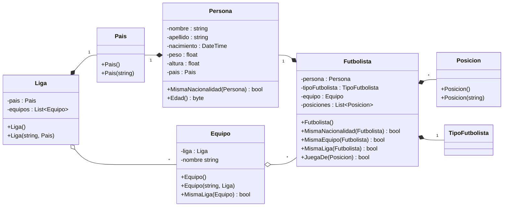

## Diagrama de Clases - Futbol12.Futbol

```mermaid
classDiagram
direction LR
class Liga{
    -pais : Pais
    -equipos : List~Equipo~
    +Liga()
    +Liga(string, Pais)
}

Liga *-- "1" Pais
Liga o-- "*" Equipo

class Pais{
    +Pais()
    +Pais(string)
}

Pais "1" --* Persona

class Persona{
    -nombre : string
    -apellido : string
    -nacimiento : DateTime
    -peso : float
    -altura : float
    -pais : Pais
    +MismaNacionalidad(Persona) bool
    +Edad() byte
}

Persona "1" --* Futbolista

class Equipo{
    -liga : Liga
    -nombre string
    +Equipo()
    +Equipo(string, Liga)
    +MismaLiga(Equipo) bool
}

Equipo o-- "*" Futbolista

class Futbolista{
    -persona : Persona
    -tipoFutbolista : TipoFutbolista
    -equipo : Equipo
    -posiciones : List~Posicion~
    +Futbolista()
    +MismaNacionalidad(Futbolista) bool
    +MismaEquipo(Futbolista) bool
    +MismaLiga(Futbolista) bool
    +JuegaDe(Posicion) bool
}

Futbolista *-- "*" Posicion
Futbolista *-- "1" TipoFutbolista

class Posicion{
    +Posicion()
    +Posicion(string)
}

```
