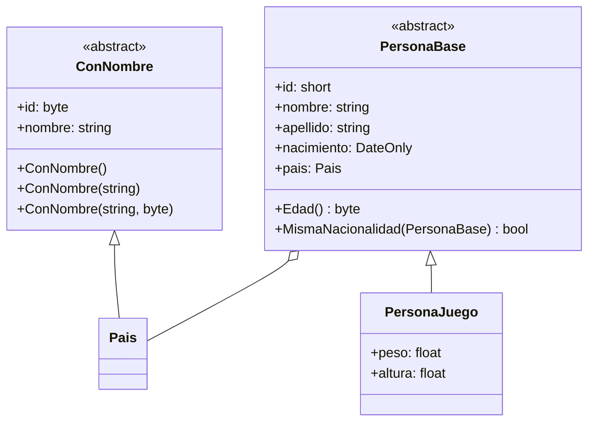

## Diagrama de Clases - Futbol12.Core

```mermaid
classDiagram

class ConNombre{
    <<abstract>>
    +id: byte
    +nombre: string
    +ConNombre()
    +ConNombre(string)
    +ConNombre(string, byte)
}

ConNombre <|-- Pais

class PersonaBase{
    <<abstract>>
    +id: short
    +nombre: string
    +apellido: string
    +nacimiento: DateOnly
    +pais: Pais
    +Edad() byte
    +MismaNacionalidad(PersonaBase) bool
}

PersonaBase o-- Pais

class PersonaJuego{
    +peso: float
    +altura: float
}

PersonaBase <|-- PersonaJuego
```
