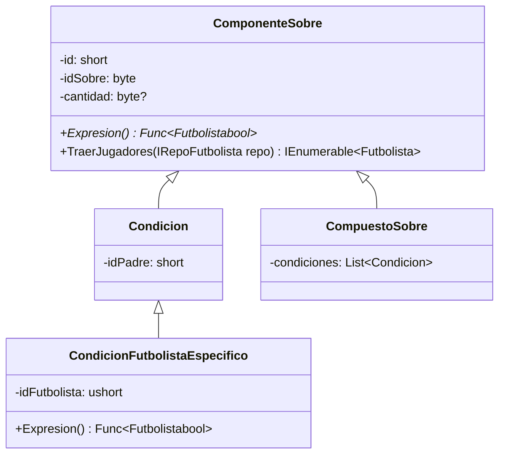

### Sobres

La idea es crear un sistema para generar sobres que contengan futbolistas traidos al azar.

```mermaid
classDiagram
    class ComponenteSobre{
        -id: short
        -idSobre: byte
        -cantidad: byte?
        +Expresion()* Func~Futbolistabool~
        +TraerJugadores(IRepoFutbolista repo) IEnumerable~Futbolista~
    }

    class Condicion{
        -idPadre: short
    }
    ComponenteSobre <|-- Condicion

    class CondicionFutbolistaEspecifico{
        -idFutbolista: ushort
        +Expresion() Func~Futbolistabool~
    }
    Condicion <|-- CondicionFutbolistaEspecifico
    
    class CompuestoSobre{
        -condiciones: List~Condicion~
    }
    ComponenteSobre <|-- CompuestoSobre    

```